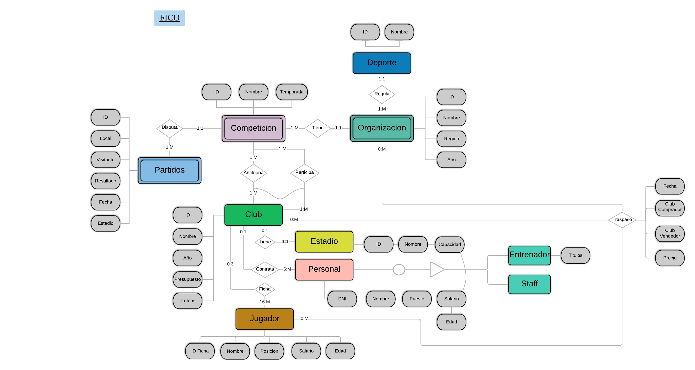

# FICO

  
  
Federacion Internacional de Clubes y Organizaciones

# Contexto

*FICO* es una federación internacional que se encarga del seguimiento y registro de las organizaciones de cualquier tipo de deporte, dentro de cada organización se incluyen competiciones, en las cuales están registrados los clubes, así como los partidos que se disputan, luego, dentro de cada club se encuentra su personal, dentro de este, pueden haber dos categorías, entrenador, o el miembro staff, como utilleros, preparadores, etc, sus jugadores y su estadio.

A su vez lleva un control estricto sobre los traspasos  de jugadores que se producen a tiempo real dentro de cada uno de los clubes dentro de cada organización.

# Requisitos

Las organizaciones mencionadas anteriormente se encargan de gestionar un solo deporte en una región determinada. Sin embargo, sobre un *deporte* pueden existir varias organizaciones. Es importante mencionar que las organizaciones dependen de su deporte, si el deporte no existe, no puede existir una organización del mismo.

De cada *organización* pueden surgir varias competiciones, (P.E de la RFEF surgen competiciones como La Liga Santander, La Liga Smartbank, La Copa del Rey, etc), pero cada una de estas competiciones solo pertenecen a una organización. Al igual que antes, las competiciones dependen de las organizaciones, sin organización no hay competición.

Dentro de cada *competición* se registran los partidos que se disputan dentro de esa competición, por lo tanto cada partido depende de su competición. Una competición tiene al menos 1 partido, pero un partido solo pertenece a una sola competición.

Dentro de cada competición participan los *clubes*, los cuales pueden participar en múltiples competiciones. Se puede dar el caso de que un club no participa en ninguna competición, es una entidad fuerte. Por otro lado existe un caso de inclusividad, un club puede ser el anfitrión de una competición (cede su estadio para que se juegue la competición en el mismo), pero para que eso suceda debe al menos participar en 3 competiciones cualesquiera.

Cada club tiene su propio *estadio* asignado, pero pueden existir estadios que no pertenecen a algún club. Luego cada club contrata a su *personal*, como preparadores, médicos, utilleros, etc, cada uno se diferencia por Staff o Entrenador. Un personal puede pertenecer a un solo club o a ninguno. Por último cada club tiene fichado a al menos 16 *jugadores* con los que puede jugar, sin embargo un jugador puede estar fichado de 0 a 2 clubes, 0 si juega en ninguno, 1 si juega en algún club, o 2 si juega en un club y en su selección nacional.

Por último existen los *traspasos*, jugadores que fichan de un club a otro, los cuales están supervisados por las organizaciones. Una organización puede supervisar muchos traspasos, o ninguno si no se producen en su organización. Un club puede fichar muchos o ningún jugador, lo mismo ocurre con un jugador, que puede fichar por muchos clubes o ninguno.

# Diagrama Entidad Relacion

  
  
Modelo Entidad Relacion

