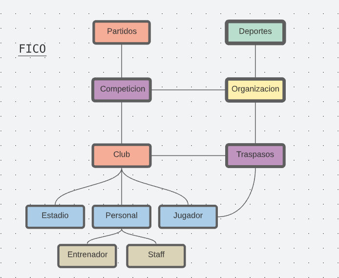

# FICO

  
  
Federacion Internacional de Clubes y Organizaciones

# Contexto

*FICO* es una federación internacional que se encarga del seguimiento y registro de las organizaciones de cualquier tipo de deporte, dentro de cada organización se incluyen competiciones, en las cuales están registrados los clubes, así como los partidos que se disputan, luego, dentro de cada club se encuentra su personal, dentro de este, pueden haber dos categorías, entrenador, o el miembro staff, como utilleros, preparadores, etc, sus jugadores y su estadio.

A su vez lleva un control estricto sobre los traspasos  de jugadores que se producen a tiempo real dentro de cada uno de los clubes dentro de cada organización.

  
   
  <figcaption>Esquema Preliminar</figcaption>

